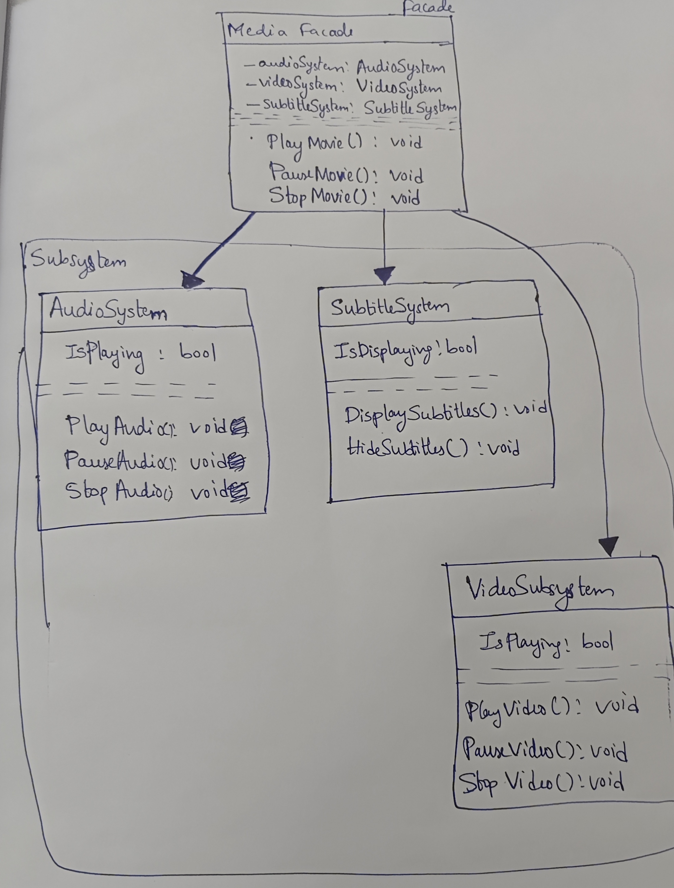

# Facade Design Pattern

## Overview
The **Facade Design Pattern** simplifies interactions with complex systems by providing a unified interface. It allows clients to use a system without dealing with its underlying complexity.

## Why Use the Facade Pattern?
- **Simplification**: Reduces the complexity of using a subsystem by providing a straightforward API.
- **Decoupling**: Minimizes dependencies between the client and the subsystem.
- **Maintainability**: Makes the system easier to maintain by hiding the implementation details.

## Benefits
- **Ease of Use**: Simplifies the client’s interaction with the system.
- **Controlled Access**: Manages access to certain parts of the subsystem.
- **Improved Structure**: Organizes the system into more manageable modules.

## CLASS DIAGRAM

